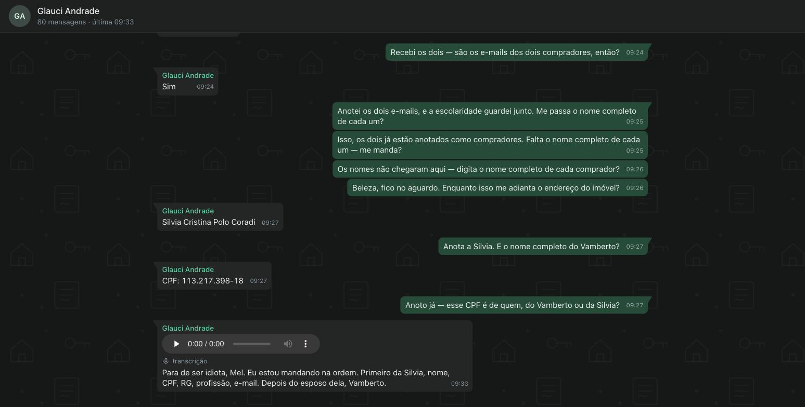
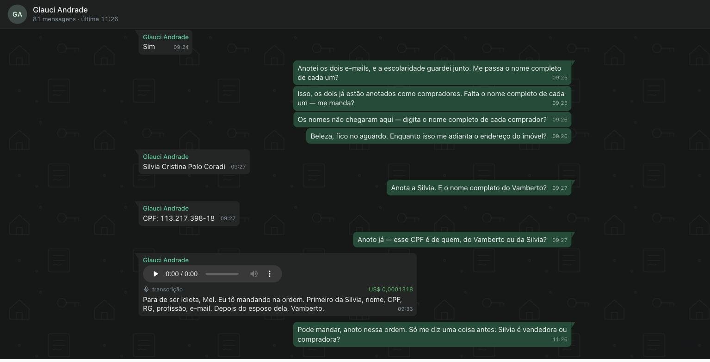
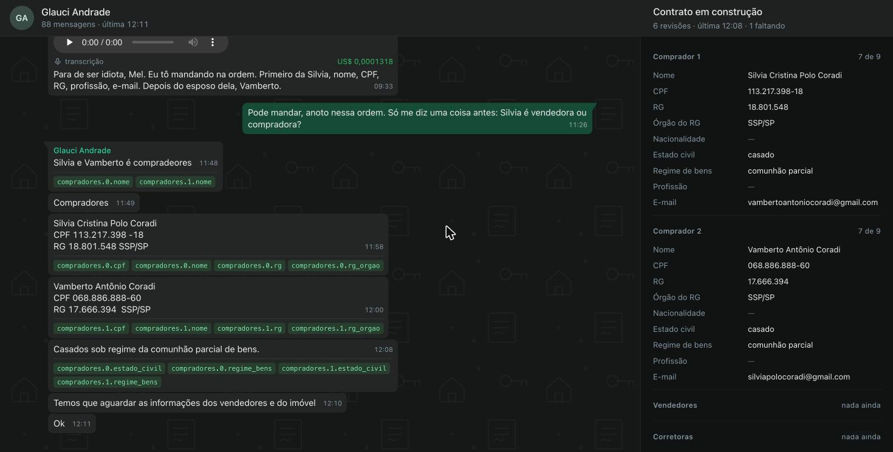

# 14/09 — o dia em que o Stem ouviu a primeira cliente

Os melhores takes do dia, na ordem em que aconteceram, para virar postagem. Cada um diz o que a imagem mostra e
por que ela importa; o dado pessoal da conversa fica fora do texto e deve ser borrado antes de publicar.

## 01 · A conversa da Glauci, ao vivo, dentro do Stem



A home do Via Corretor, construída no Stem, mostra a conversa real da Glaucilene com a Mel no WhatsApp, no
mesmo desenho do app que ela usa: os balões dela à esquerda, os da Mel em verde à direita, e um papel de parede
com casa, chave e contrato em traço fino. Ninguém escreveu HTML para essa tela. O agente do Stem compôs a view
pelo MCP, a partir de duas primitivas novas do framework, `Thread` e `Bubble`.

A mensagem de baixo é o take: a nota de voz que a Mel nunca ouviu, com o áudio original tocável e a transcrição
embaixo — "Para de ser idiota, Mel. Eu estou mandando na ordem." É o incidente do dia inteiro numa bolha só.

O caminho até a tela:

```
zap da VPS ──ssh zap tail──▶ ponte ──POST /zap/messages──▶ Stem ──▶ a home se redesenha
                               └──POST /zap/audio──▶ o .ogg original e o custo da transcrição
```

- 80 mensagens de histórico entraram por uma rota que o agente aprendeu na primeira chamada e cristalizou em programa: da segunda em diante ela roda sem modelo.
- A página se atualiza sozinha a cada mensagem nova: toda escrita bem-sucedida avisa as páginas abertas.
- Tirada às 11:01 em `viacorretor.localhost`.

## 02 · O áudio que a Mel não ouvia, transcrito em produção, com o custo ao lado



A mesma nota de voz, uma hora depois. O zap de produção deixou de esperar um transcritor que só existia no Mac: a
nota passou pelo OpenRouter com o `google/gemini-2.5-flash-lite`, só no chat da Glaucilene, e custou
**US$ 0,0001318**. O custo aparece em verde na própria bolha, ao lado do player com o áudio original.

A última bolha é a prova de ponta a ponta. Às 11:26, a Mel respondeu ao que ouviu: "Pode mandar, anoto nessa
ordem. Só me diz uma coisa antes: Silvia é vendedora ou compradora?" Horas antes, a mesma mensagem ficava muda
numa fila.

- O modelo saiu de uma medição no mesmo dia: seis modelos com áudio contra a nota real. O Flash Lite foi o único que acertou a transcrição inteira pelo menor preço (US$ 0,00022 com interpretação; US$ 0,00013 só transcrevendo). DeepSeek Flash e GLM Flash não aceitam áudio.
- Mil minutos de áudio dela custam menos de um dólar.
- Tirada às 11:28 em `viacorretor.localhost`.

## 03 · O contrato se montando ao lado da conversa, e o erro que ninguém tinha visto



A tela virou mesa. À esquerda, a conversa; embaixo de cada mensagem da Glaucilene, em verde, o campo que ela fez a
Mel gravar — só o que aquela mensagem mudou —, e em vermelho o que ela trouxe e ninguém gravou. À direita, o
contrato em construção, montado das seis revisões que a Mel salvou: um bloco por comprador, "7 de 9", e o que falta.

O take vale pelo que o painel achou sozinho: os e-mails estão trocados. O do Comprador 1 é o do Vamberto e o do
Comprador 2 é o da Silvia. Na conversa ninguém percebeu; lado a lado, salta aos olhos.

- De onde vem cada coisa: as revisões e as chamadas `record_field` saem das sessões da Mel no pipi; o "deveria ter detectado" é o `gemini-2.5-flash` lendo as mesmas mensagens (US$ 0,0014 por leitura).
- A tela foi pedida ao agente do Stem pelo MCP, com três primitivas novas: `Desk`, `Aside` e `Field`.
- Uma mensagem nova da Glaucilene refaz o retrato do contrato, no máximo uma vez por minuto.
- Tirada às 13:40 em `viacorretor.localhost`.
